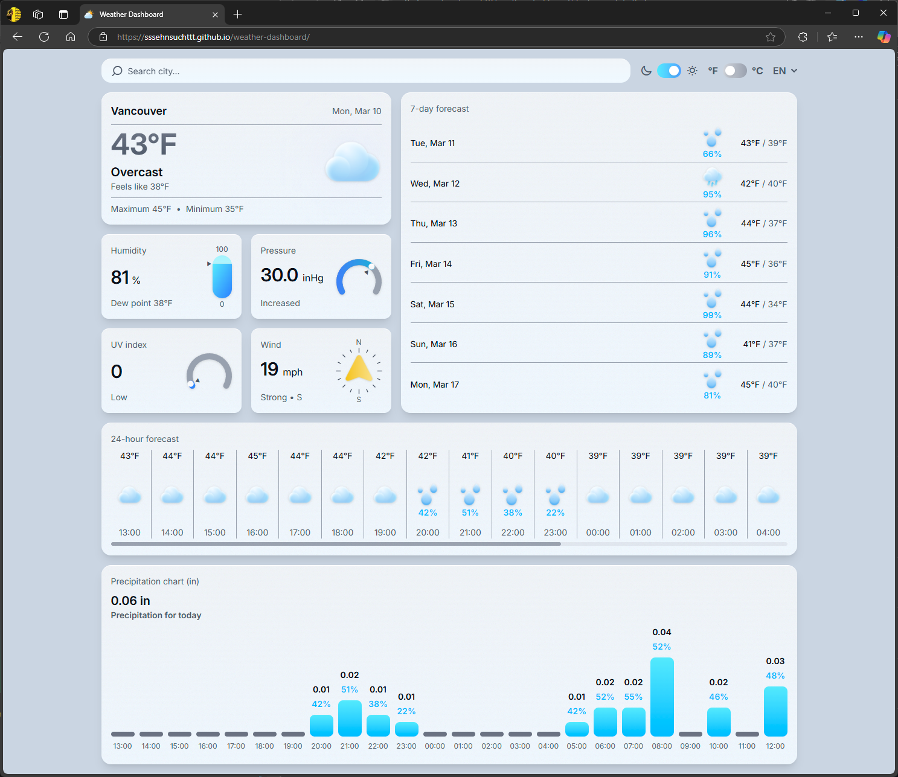
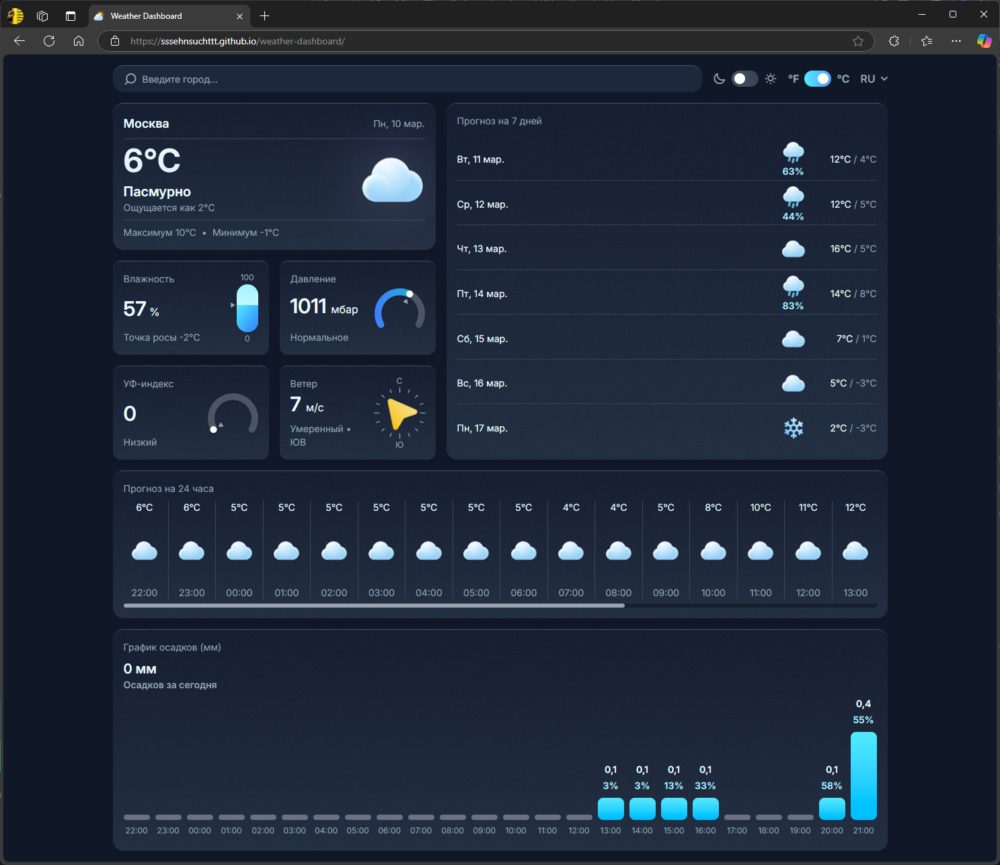
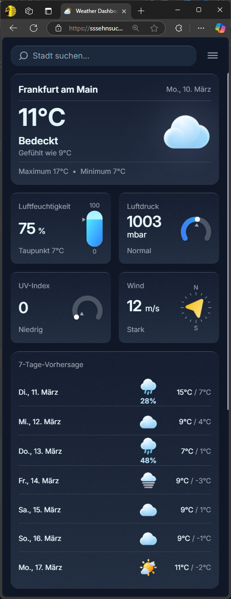

# Weather Dashboard

📖 **English version:** [README_EN.md](/README.en.md)

Это погодное веб-приложение с **адаптивным дизайном, кастомной визуализацией данных и анимациями**. Приложение выполнено в **минималистичном и неоморфном стиле**, с поддержкой темной и светлой темы.  

Используются **Open-Meteo API** для получения данных о погоде и **Open-Meteo Geocoding API + Nominatim** для поиска городов.

## Демо
🔗 [Открыть приложение](https://sssehnsuchttt.github.io/weather-dashboard/)  

---

## Используемый стек

- **React 19**
- **Vite**
- **Tailwind CSS**
- **Framer Motion**
- **Next-Themes**
- **i18next**
- **React-Loading-Skeleton**
- **Axios**
- **Open-Meteo API**
- **Open-Meteo Geocoding API + Nominatim**

---

## Реализованный функционал

### Основные возможности
- Поиск городов с автодополнением (**Open-Meteo Geocoding API + Nominatim**)  
- Определение текущего местоположения  
- Данные о текущей погоде (**Open-Meteo API**)  
- Прогноз на 7 дней  
- Почасовой прогноз  

### Адаптивность и кастомизация
- **Дизайн в стиле минимализма и неоморфизма**  
- Полностью адаптивный интерфейс
- Темная и светлая тема  
- Переключение единиц измерения (метрическая и имперская системы)  
- Поддержка нескольких языков  

### Интерактивность и визуализация данных
- Плавные анимации элементов (Framer Motion)  
- Динамическое построение визуализаций без сторонних библиотек  

---

## Особенности проекта

- **Современный и удобный UI**  
Приложение разработано в **стиле неоморфизма**, что делает интерфейс мягким и визуально привлекательным. Используются **плавные переходы и тени**, создающие эффект глубины.  

- **Гибкая система отображения данных**  
Кастомные графики обеспечивают **адаптивность и масштабируемость**, автоматически подстраиваясь под ширину экрана.  

- **Оптимизированная работа с API**  
Данные кешируются в **localStorage** для минимизации запросов и экономии трафика.  

- **Простота и удобство использования**  
Интерфейс интуитивно понятен, а переключение между настройками (темы, язык, единицы измерения) реализовано через **управление состоянием**.  

---

## Установка и запуск

```sh
git clone https://github.com/sssehnsuchttt/weather-dashboard.git
cd weather-dashboard
npm install
npm run dev
```

---

## Скриншоты



.png)
.png)
 .png)
.png) .png)
